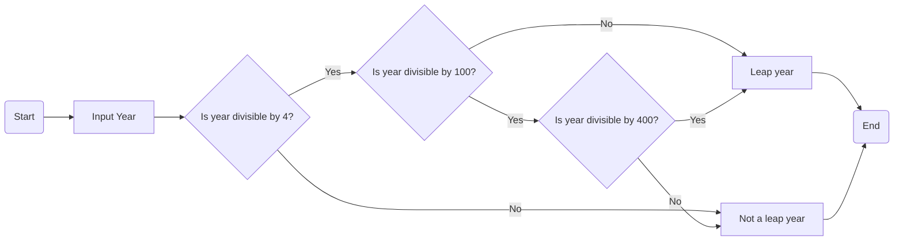

# Design Process

## Conceptual Design

Outline of the initial ideas and conceptual approach to the problem.

## Algorithm Design

Detailed presentation of the developed algorithm, including flowcharts and pseudocode. See [this guide on creating mermaid flowcharts](https://mermaid.js.org/syntax/flowchart.html).



```
FUNCTION isLeapYear(year):
    IF year MODULO 4 IS NOT EQUAL TO 0:
        RETURN False
    ELSE IF year MODULO 100 IS NOT EQUAL TO 0:
        RETURN True
    ELSE IF year MODULO 400 IS EQUAL TO 0:
        RETURN True
    ELSE:
        RETURN False

year = INPUT "Enter a year: "
IF isLeapYear(year):
    PRINT year, "is a leap year."
ELSE:
    PRINT year, "is not a leap year."
```
