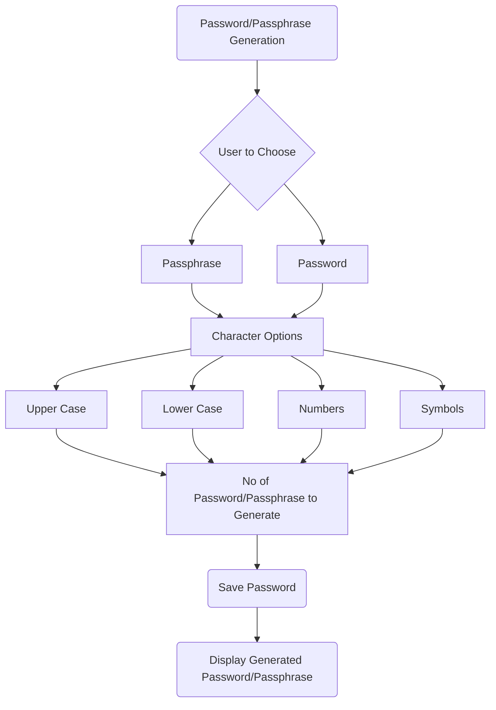

# Executive Summary

This project involves the creation of a password or passphrase generator, where the user has the choice of a few options for their password or passphrase. This report involves the documentation of the processes in details involved in the creation of the program.

# Project Overview

## Introduction

The chosen case study for this project was the "Secure Password Generator". This was chosen as an easy way for users generate 1 or more passwords that are secure for multiple online accounts at once. This takes out the need to try and make up different passwords for different accounts. The program should give users the ability to choose a set of perameters for the output passwords/phrases. The program should also use a cryptographically secure pseudorandom number generator (CSPRNG) for the generation of passwords.

## Team Structure and Roles

A description of how your team was organised, including the roles and responsibilities of each member
- Isaac: Organiser, works mainly on documentation
- Raja: Works mainly on the documentation
- Josh: Works mainly on the code

## Problem Analysis and Requirements

The problem faced is the need for a program that generates multiple passwords or pasphrases as people generally have multiple online acounts. This will provide an easy way to make multiple passwords without having to worry about thinking about what a new password should be. This also reduces the risk of reusing passwords. Requirements are disscussed in the Design Process section bellow.

# Design Process

## Conceptual and Algorithm Design

Detailed presentation of the developed algorithm, including flowcharts and pseudocode. See [this guide on creating mermaid flowcharts](https://mermaid.js.org/syntax/flowchart.html).

### Requirements:

1. Allow users to choose whether they would like to generate a password or passphrase.

2. Allow users to choose the length of the password/phrase. (The number of characters for a password /or the number of words for a passphrase.)

3. Allow the user to choose the character sets they wish to use, eg. uppercase, lowercase, numbers, symbols.

4. Allow the user to choose the number of passwords/phases they would like to generate.

5. Allow the user to choose an output file to place the generated password(s). (enabled with command line option i.e. -o)

6. The results should always be printed to the screen and optionally an output file.




### Pseudocode:
```
IMPORT required modules

OPEN word dictionaries
  SET [Words] as dictionaries content

SET [specialChars] as '!"#$%&()*+,-./:;<=>?@[\]^_`{|}~'
SET [special] as random digit in [specialChars]

DEFINE generate password function
  SET [characterPool] as inputed choice of [character sets]
  RETURN password using the character pool and inputed length

DEFINE generate passphrase
  RETURN passphrase using [Words] and using [special] as space between words and inputed length

DEFINE main function
  DEFINE arg parser for "-o" and "--ouput" used for saving password to output file

  INPUT password or passphrase

  INPUT length   # (amount of words or letters)

  IF password
    SET [character sets] as list
    INPUT include uppercase? y/n
    IF y
      ADD to [character sets]
    INPUT include lowercase? y/n
    IF y
      ADD to [character sets]
    INPUT include numbers? y/n
    IF y
      ADD to [character sets]
    INPUT include symbols? y/n
    IF y
      ADD to [character sets]

    IF no inputs
      DISPLAY no character sets error message

  INPUT number of passwords/phrases to generate as [num generate]

  IF passphrase
    INPUT replace space between words with special characters? y/n as [space choice]

  RUN generate password or passphrase function with required inputs

  DISPLAY password(s) or passphrase(s)

  IF program ran with -o argument
    OUTPUT password(s) or passphrase(s) to a file

RUN main function
```


## Software Design

Explanation of the software design, including the choice of programming language and the software architecture.

# Implementation

## Code Development

Note: Code cannot be run properly without other files. To see all files please refer to folder containing source code.

```python
# Name: Joshua Kovzan, Raja MC
# Contact: Bootlessfire@gmail.com
# Date created: 27/05/2024
# Last updated: 11/06/2024


import secrets
import string
import argparse

# Setting up Mark's wordlist for passphrase words
with open('adjectives.txt', 'r') as f:
    adjectives = [line.strip() for line in f]

with open('nouns.txt', 'r') as f:
    nouns = [line.strip() for line in f]

with open('verbs.txt', 'r') as f:
    verbs = [line.strip() for line in f]

# Special characters for spacing in passphrase
specialChars = '!"#$%&()*+,-./:;<=>?@[\]^_`{|}~'


def generate_password(length, char_sets):
    char_pool = ''.join(char_sets)
    return ''.join(secrets.choice(char_pool) for _ in range(length))


def generate_passphrase(length):
    return ' '.join(secrets.choice(adjectives + nouns + verbs) for _ in range(length))


def generate_passphrase_special(length):
    return f'{secrets.choice(specialChars)}'.join(secrets.choice(adjectives + nouns + verbs) for _ in range(length))
    #  ^ choice in the f-string for different character each passphrase


def main():
    # Setting up argument parser
    parser = argparse.ArgumentParser(description="Generate secure passwords or passphrases.")
    parser.add_argument('-o', '--output', type=str, help="Output file to save the generated passwords/phrases.")
    args = parser.parse_args()

    # Step 1: User chooses between password and passphrase
    while True:
        choice = input(
            "Would you like to generate a password or passphrase? (Enter 'password' or 'passphrase'): \n").strip().lower()
        if choice in ["password", "passphrase"]:
            break
        else:
            print("please enter 'password' or 'passphrase' to continue.")
        # added while loop to loop if incorrect entry

    # Step 2: User chooses the length
    while True:
        if choice == 'password':
            try:
                length = int(input("Enter the length of the password: \n"))
                if length > 0:
                    break
                else:
                    print("Please enter a positive integer")
            except ValueError:
                print("Please enter a positive integer.")

        elif choice == 'passphrase':
            try:
                length = int(input("Enter the number of words in the passphrase: \n"))
                if length > 0:
                    spcChoice = input(
                        "Would you like to replace space between words with a special character? y/n \n").strip().lower()
                    break
                    #  had to add spcChoice here to avoid it being prompted in password path
                else:
                    print("Please enter a positive integer.")
            except ValueError:
                print("Please enter a positive integer.")
            # added try/excpet to avoid value errors if user doesn't add integers

    # Step 3: User chooses the character sets for passwords
    if choice == 'password':
        char_sets = []
        while True:
            upper = input("Include uppercase letters? (y/n): \n").strip().lower()
            if upper == "y":
                char_sets.append(string.ascii_uppercase)
                break
            elif upper == "n":
                break
            else:
                print("Please enter 'y' or 'n'")

        while True:
            lower = input("Include lowercase letters? (y/n): \n").strip().lower()
            if  lower == "y":
                char_sets.append(string.ascii_lowercase)
                break
            elif lower == "n":
                break
            else:
                print("Please enter 'y' or 'n'")

        while True:
            numbers = input("Include numbers? (y/n): \n").strip().lower()
            if numbers == "y":
                char_sets.append(string.digits)
                break
            elif numbers == "n":
                break
            else:
                print("Please enter 'y' or 'n'")

        while True:
            symbols = input("Include symbols? (y/n): \n").strip().lower()
            if symbols == 'y':
                char_sets.append(string.punctuation)
                break
            elif symbols == "n":
                break
            else:
                print("Please enter 'y' or 'n'")

        if not char_sets:
            input("No character sets selected. Please press enter to restart the program.")
            exit()

    # Step 4: User chooses the number of passwords/phrases to generate
    while True:
        try:
            num_generate = int(input("Enter the number of passwords/phrases to generate: \n"))
            if num_generate > 0:
                break
            else:
                print("Please enter a positive integer.")
        except ValueError:
            print("Please enter a positive integer.")
        #  ^ added try/except to make sure num_generate was an integer

    # Generate and display the passwords or passphrases
    results = []
    for _ in range(num_generate):
        if choice == 'password':
            result = generate_password(length, char_sets)
        elif choice == 'passphrase':
            if spcChoice == 'y':
                result = generate_passphrase_special(length)
            elif spcChoice == 'n':
                result = generate_passphrase(length)
        results.append(result)
        print(result)

    # Step 5: Optionally save to an output file
    if args.output:
        with open(args.output, 'w') as file:
            for result in results:
                file.write(result + '\n')


if __name__ == "__main__":
    main()

'''
Run the script without specifying an output file
python generate_passwords.py


Run the script with an output file
python generate_passwords.py -o output.txt

'''
```

## Testing and Debugging

Documentation of the testing process, including test cases, results, and any debugging carried out.

# Collaboration and Project Management

## Meeting Notes

Refer to seperate markdown file.

## Project Management Tools and Techniques

Tools used include the use of Trello to track progress, and GitHub to collaborate and congregate documentation. There were regular meetings to discuss progress, and what everyone should work on and towards. This helped to prevent falling behind on tasks.

# Documentation

## Developer Documentation

Please refer to seperate word file.

## User Documentation

Please refer to seperate word file.

# Reflection and Conclusion

Reflection on the challenges faced during the project and how they were overcome, along with a discussion of the learning outcomes and skills developed. Summarise the project results, its success in meeting the objectives, and potential areas for future development or improvement.

# Appendices

Links to the code repositories containing the final source code, separate user manuals, presentations, or other documentation (if any).

Any other relevant materials, such as additional diagrams, extended testing documentation, or supplementary research.

References: A list of all the sources referenced throughout the project.
