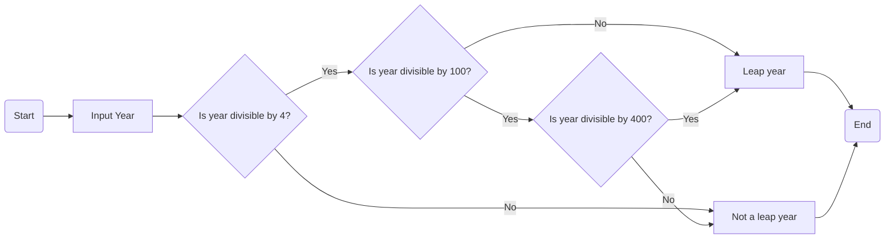

# Executive Summary

Brief summary of the report that provides a high-level overview of the project

# Project Overview

## Introduction

Detailed background information on the chosen case study, the need for automation, and the objectives of the project.

## Team Structure and Roles

A description of how your team was organised, including the roles and responsibilities of each member.

## Problem Analysis and Requirements

A thorough analysis of the problem presented in the case study and the specific requirements for the automation solution.

# Design Process

## Conceptual Design

Outline of the initial ideas and conceptual approach to the problem.

## Algorithm Design

Detailed presentation of the developed algorithm, including flowcharts and pseudocode. See [this guide on creating mermaid flowcharts](https://mermaid.js.org/syntax/flowchart.html).



```
FUNCTION isLeapYear(year):
    IF year MODULO 4 IS NOT EQUAL TO 0:
        RETURN False
    ELSE IF year MODULO 100 IS NOT EQUAL TO 0:
        RETURN True
    ELSE IF year MODULO 400 IS EQUAL TO 0:
        RETURN True
    ELSE:
        RETURN False

year = INPUT "Enter a year: "
IF isLeapYear(year):
    PRINT year, "is a leap year."
ELSE:
    PRINT year, "is not a leap year."
```

## Software Design

Explanation of the software design, including the choice of programming language and the software architecture.

# Implementation

## Code Development

The actual code written for the project, with appropriate comments and explanations. If appropriate, this can just be a note to refer to a particular source code file or repository.

```python
#!/usr/bin/env python3

def is_leap_year(year):
    """Determine if a year is a leap year."""
    if year % 4 != 0:
        return False
    elif year % 100 != 0:
        return True
    elif year % 400 == 0:
        return True
    else:
        return False

# Input from the user
year = int(input("Enter a year: "))

# Check and display the result
if is_leap_year(year):
    print(f"{year} is a leap year.")
else:
    print(f"{year} is not a leap year.")
```

## Testing and Debugging

Documentation of the testing process, including test cases, results, and any debugging carried out.

# Collaboration and Project Management

## Meeting Notes

Records of team meetings, including decisions made and action items.

## Project Management Tools and Techniques

Overview of the tools and methodologies used for project management and collaboration.

# Documentation

## Developer Documentation

Detailed explanation of the code and architecture, aimed at future developers who might work on or maintain the project.

## User Documentation

User-friendly guide or manual, explaining how to use the automated solution. It is recommended that you add this as a separate document, rather than putting the documentation here.

# Reflection and Conclusion

Reflection on the challenges faced during the project and how they were overcome, along with a discussion of the learning outcomes and skills developed. Summarise the project results, its success in meeting the objectives, and potential areas for future development or improvement.

# Appendices

Links to the code repositories containing the final source code, separate user manuals, presentations, or other documentation (if any).

Any other relevant materials, such as additional diagrams, extended testing documentation, or supplementary research.

References: A list of all the sources referenced throughout the project.