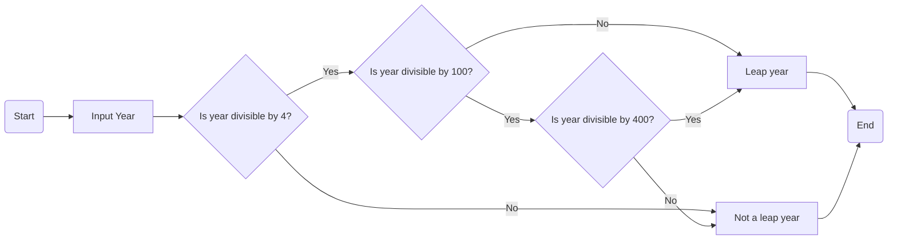

# Executive Summary

This project involves the creation of a password or passphrase generator, where the user has the choice of a few options for their password or passphrase. This report involves the documentation of the processes in details involved in the creation of the program.

# Project Overview

## Introduction

The chosen case study for this project was the "Secure Password Generator". This was chosen as an easy way for users generate 1 or more passwords that are secure for multiple online accounts at once. This takes out the need to try and make up different passwords for different accounts. The program should give users the ability to choose a set of perameters for the output passwords/phrases. The program should also use a cryptographically secure pseudorandom number generator (CSPRNG) for the generation of passwords.

## Team Structure and Roles

A description of how your team was organised, including the roles and responsibilities of each member
- Isaac: Organiser, works mainly on documentation
- Raja: Works mainly on the documentation
- Josh: Works mainly on the code

## Problem Analysis and Requirements

A thorough analysis of the problem presented in the case study and the specific requirements for the automation solution.

# Design Process

## Conceptual Design

Outline of the initial ideas and conceptual approach to the problem.

## Algorithm Design

Detailed presentation of the developed algorithm, including flowcharts and pseudocode. See [this guide on creating mermaid flowcharts](https://mermaid.js.org/syntax/flowchart.html).

### Requirements:

1. Allow users to choose whether they would like to generate a password or passphrase.

2. Allow users to choose the length of the password/phrase. (The number of characters for a password /or the number of words for a passphrase.)

3. Allow the user to choose the character sets they wish to use, eg. uppercase, lowercase, numbers, symbols.

4. Allow the user to choose the number of passwords/phases they would like to generate.

5. Allow the user to choose an output file to place the generated password(s). (enabled with command line option i.e. -o)

6. The results should always be printed to the screen and optionally an output file.




### Pseudocode:
```
IMPORT required modules

OPEN word dictionaries
  SET [Words] as dictionaries content

SET [specialChars] as '!"#$%&()*+,-./:;<=>?@[\]^_`{|}~'
SET [special] as random digit in [specialChars]

DEFINE generate password function
  SET [characterPool] as inputed choice of [character sets]
  RETURN password using the character pool and inputed length

DEFINE generate passphrase
  RETURN passphrase using [Words] and using [special] as space between words and inputed length

DEFINE main function
  DEFINE arg parser for "-o" and "--ouput" used for saving password to output file

  INPUT password or passphrase

  INPUT length   # (amount of words or letters)

  IF password
    SET [character sets] as list
    INPUT include uppercase? y/n
    IF y
      ADD to [character sets]
    INPUT include lowercase? y/n
    IF y
      ADD to [character sets]
    INPUT include numbers? y/n
    IF y
      ADD to [character sets]
    INPUT include symbols? y/n
    IF y
      ADD to [character sets]

    IF no inputs
      DISPLAY no character sets error message

  INPUT number of passwords/phrases to generate as [num generate]

  IF passphrase
    INPUT replace space between words with special characters? y/n as [space choice]

  RUN generate password or passphrase function with required inputs

  DISPLAY password(s) or passphrase(s)

  IF program ran with -o argument
    OUTPUT password(s) or passphrase(s) to a file

RUN main function
```


## Software Design

Explanation of the software design, including the choice of programming language and the software architecture.

# Implementation

## Code Development

The actual code written for the project, with appropriate comments and explanations. If appropriate, this can just be a note to refer to a particular source code file or repository.

```python
#!/usr/bin/env python3

def is_leap_year(year):
    """Determine if a year is a leap year."""
    if year % 4 != 0:
        return False
    elif year % 100 != 0:
        return True
    elif year % 400 == 0:
        return True
    else:
        return False

# Input from the user
year = int(input("Enter a year: "))

# Check and display the result
if is_leap_year(year):
    print(f"{year} is a leap year.")
else:
    print(f"{year} is not a leap year.")
```

## Testing and Debugging

Documentation of the testing process, including test cases, results, and any debugging carried out.

# Collaboration and Project Management

## Meeting Notes

Records of team meetings, including decisions made and action items.

## Project Management Tools and Techniques

Overview of the tools and methodologies used for project management and collaboration.

# Documentation

## Developer Documentation

Detailed explanation of the code and architecture, aimed at future developers who might work on or maintain the project.

## User Documentation

User-friendly guide or manual, explaining how to use the automated solution. It is recommended that you add this as a separate document, rather than putting the documentation here.

# Reflection and Conclusion

Reflection on the challenges faced during the project and how they were overcome, along with a discussion of the learning outcomes and skills developed. Summarise the project results, its success in meeting the objectives, and potential areas for future development or improvement.

# Appendices

Links to the code repositories containing the final source code, separate user manuals, presentations, or other documentation (if any).

Any other relevant materials, such as additional diagrams, extended testing documentation, or supplementary research.

References: A list of all the sources referenced throughout the project.
